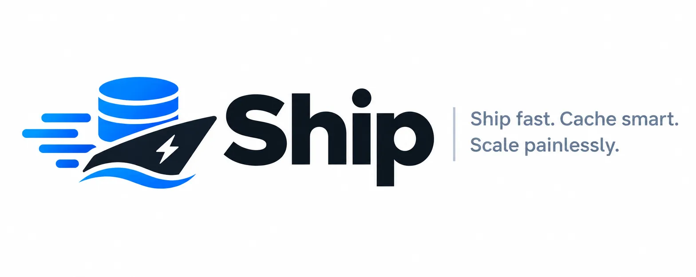

<p align="center">
  
</p>

# 🚢 Ship — Full-Stack CRUD Framework

> **Ship fast. Cache smart. Scale painlessly.**

Ship is a full-stack framework designed for building database-driven CRUD applications — think CMSes, admin panels, SaaS dashboards, and data-heavy web apps — with zero performance compromise. It combines the developer experience of **Next.js** (frontend) and **Hono.js** (backend) with a built-in, opinionated caching layer and auto-generated CRUD scaffolding.

---

## Why Ship?

Most full-stack frameworks either prioritize DX at the cost of performance, or make you wire everything up yourself. Ship is different:

- **Database-first**: Your schema drives everything — API routes, validation, UI forms, and cache keys.
- **Speed by default**: Every read operation is cached. Cache invalidation is automatic on mutations.
- **CRUD in seconds**: Define a model, ship generates the REST/RPC API, admin UI, and typed SDK.
- **No magic, all visible**: Ship generates real files you can read, edit, and own.

---

## Core Philosophy

| Principle | What it means |
|-----------|---------------|
| **Schema-first** | One source of truth — your model definition |
| **Cached by default** | Reads never hit the DB twice without reason |
| **Explicit over implicit** | Generated code is readable, not hidden in a runtime |
| **Full-stack typing** | End-to-end TypeScript from DB → API → UI |
| **Batteries included** | Auth, pagination, search, file uploads — all built-in |

---

## Documentation Index

| Doc | Description |
|-----|-------------|
| [Getting Started](./getting-started.md) | Install Ship and scaffold your first project |
| [Architecture](./architecture.md) | How the frontend, backend, and cache layer fit together |
| [Models & Schema](./models.md) | Defining your data models with Ship's schema DSL |
| [CRUD Engine](./crud.md) | Auto-generated API routes, controllers, and service layer |
| [Caching System](./caching.md) | Built-in cache layer: strategies, TTL, invalidation |
| [Frontend (Next.js)](./frontend.md) | Admin UI, data hooks, and Ship's component library |
| [Backend (Hono)](./backend.md) | Route structure, middleware, and custom handlers |
| [Auth & Permissions](./auth.md) | Built-in authentication, roles, and field-level permissions |
| [File Uploads](./uploads.md) | Storage adapters and media management |
| [Search & Filtering](./search.md) | Full-text search, faceted filters, and sorting |
| [CLI Reference](./cli.md) | `ship` CLI commands for scaffolding and code generation |
| [Configuration](./config.md) | `ship.config.ts` reference |
| [Production & Deployment](./production.md) | Docker, environment variables, and scaling |
| [Extending Ship](./plugins.md) | Writing custom plugins and adapters |

---

## Quick Taste

```ts
// ship.config.ts — define once, get everything
import { defineModel, field } from '@ship/core'

export const Post = defineModel('Post', {
  title:       field.text({ required: true, searchable: true }),
  slug:        field.slug({ from: 'title', unique: true }),
  body:        field.richText(),
  status:      field.select(['draft', 'published', 'archived'], { default: 'draft' }),
  author:      field.relation('User', { many: false }),
  tags:        field.relation('Tag',  { many: true }),
  cover:       field.image({ storage: 'r2' }),
  publishedAt: field.datetime({ nullable: true }),
}, {
  cache: { ttl: 60, strategy: 'stale-while-revalidate' },
  permissions: {
    read:   'public',
    write:  'role:editor',
    delete: 'role:admin',
  }
})
// Primary keys are MongoDB ObjectIds, serialized as hex strings in API responses
```

Running `ship generate` after this gives you:

- ✅ `GET /api/posts` — paginated list with filtering, sorting, search
- ✅ `GET /api/posts/:slug` — single record, served from cache
- ✅ `POST /api/posts` — create with validation
- ✅ `PATCH /api/posts/:id` — partial update + cache invalidation
- ✅ `DELETE /api/posts/:id` — delete + cache purge
- ✅ Admin UI page at `/admin/posts` with list, create, edit forms
- ✅ Typed client SDK: `ship.post.findMany()`, `ship.post.findBySlug()`

---

## Tech Stack

```
Frontend        → Next.js 15 (App Router)
Backend         → Hono.js (Edge-compatible)
ODM             → Mongoose 8 (schema-based, type-safe)
Database        → MongoDB (primary)
Cache           → Redis (primary) / in-memory (dev/edge)
Validation      → Zod (shared schema between FE + BE)
Auth            → Built-in JWT / Session + optional OAuth
File Storage    → Local / S3 / Cloudflare R2
Search          → Built-in MongoDB Atlas Search / optional Meilisearch
```

---

## Project Status

Ship is in **active design and development**. The core scaffolding, CRUD engine, and caching system are being built first. Contributions and feedback are welcome.
